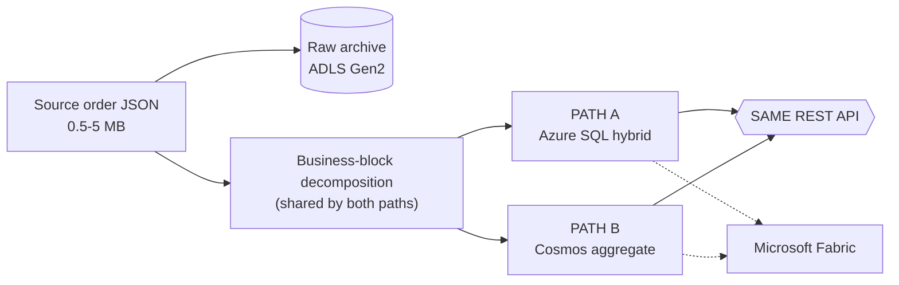
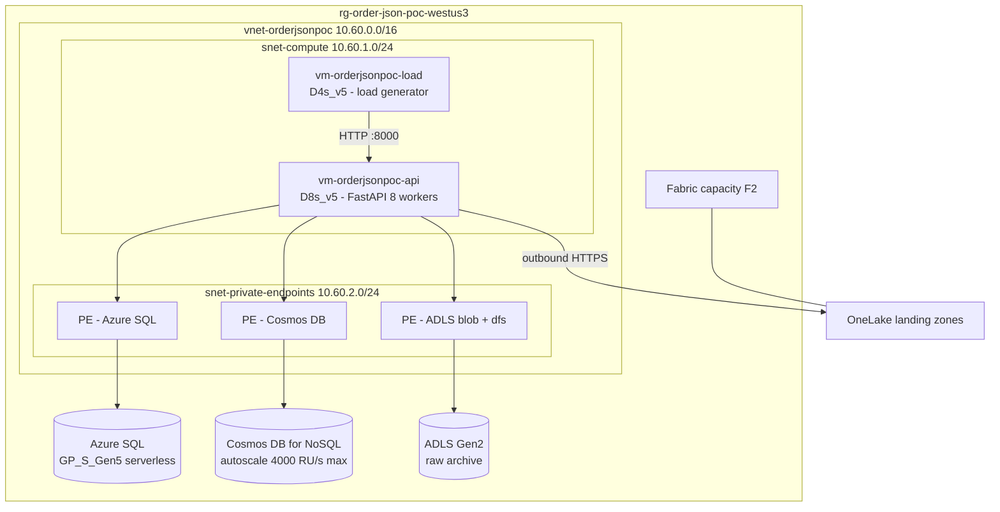

# Architecture

One source document, one API contract, two interchangeable operational stores,
one analytics platform.



Full diagrams: [end-to-end](../diagrams/end-to-end.mmd) ·
[sql-hybrid](../diagrams/sql-hybrid.mmd) ·
[cosmos-aggregate](../diagrams/cosmos-aggregate.mmd) ·
[fabric-analytics](../diagrams/fabric-analytics.mmd) ·
[comparison](../diagrams/comparison.mmd) ·
[fabric direct-serving control](../diagrams/fabric-direct-serving-control.mmd)

---

## 1. The organising idea

The measured profile ([DATA_PROFILE.md](DATA_PROFILE.md)) shows the order is not
one indivisible thing. It is 106 top-level sections where **the top 10 hold
87.9% of the bytes** and 76 of the 106 are under 1 KiB. That single fact drives
every decision here:

> Decompose the order along **business** boundaries once, in shared code, and
> let each storage engine persist those blocks in its own idiom.

[`ingestion/parser/block_splitter.py`](../ingestion/parser/block_splitter.py) is
that shared code. It is the *only* place the order is taken apart, and its
inverse is asserted to be lossless on every size profile and on the real
customer sample:

```
reassemble(split_object_data(object_data)) == object_data
```

Because both paths decompose identically, the comparison measures the *storage
engines*, not two different data models.

## 2. Layers

### 2.1 Raw retention (shared)

[`ingestion/archive/raw_archive.py`](../ingestion/archive/raw_archive.py)

```
raw/{customerId}/{orderId}/{version}/order.json.gz
```

Write-once; re-writing an existing `(order, version)` raises unless explicitly
overridden. Backed by ADLS Gen2 with Entra auth, with a filesystem
implementation for offline runs and unit tests.

Purposes: immutable source retention, replay, reprocessing, audit, two-year
history, schema-evolution recovery.

**The archive is deliberately NOT on the API read path.** Nothing in
`GET /orders/{id}` touches it, so archive latency never appears in the
operational p95 and the archive can live on a cheap storage tier.

### 2.2 Parse and validate

[`parse_envelope`](../ingestion/parser/block_splitter.py) pulls identity
(`customerId`, `orderId`, `orderVersion`) out of the extract envelope and raises
on a shape it does not recognise, rather than producing a half-populated order.

### 2.3 Operational stores

| | PATH A — Azure SQL | PATH B — Cosmos DB |
| --- | --- | --- |
| Searched fields | relational columns across 8 tables | `search{}` on one header item |
| Pass-through payload | `OrderJsonBlocks.JsonPayload` `nvarchar(max)` | `data{}` on block items, excluded from indexing |
| Blocks per order | ~34 rows | ~34 items + 1 header |
| Full-order read | 2 queries, then reassemble | 1 single-partition query, then reassemble |
| Details | [SQL_DESIGN.md](SQL_DESIGN.md) | [COSMOS_DESIGN.md](COSMOS_DESIGN.md) |

### 2.4 The API

[`app/api/main.py`](../app/api/main.py) — endpoint logic written **once**.
The backend is selected at startup from `STORAGE_BACKEND`, and every endpoint
talks to the [`OrderRepository`](../app/repositories/base.py) interface.

[API_DESIGN.md](API_DESIGN.md) has the contract. The
[contract tests](../tests/contract/test_api_equivalence.py) assert that
`API(SQL)` and `API(Cosmos)` are semantically equivalent for every endpoint at
every size profile — and they have already caught two real divergences (GUID
casing and money-aggregate rounding).

### 2.5 Analytics

Both stores feed the same Fabric model. See
[FABRIC_ANALYTICS.md](FABRIC_ANALYTICS.md).

---

## 3. Deployment topology as actually built



### Why the load generator is a separate VM

Workload C sends multi-megabyte responses at 50 RPS. On a single host those
would travel over loopback at memory speed and the generator's CPU would compete
with the API's, making the result meaningless. Two VMs on one VNet means the
payload crosses a real NIC and the two CPU budgets are independent.

### Why everything is behind a private endpoint

Tenant policy (`MCAPSGovDenyPolicies`) forces `publicNetworkAccess=Disabled` on
Azure SQL, Cosmos DB and Storage in this subscription. That is recorded as an
environment constraint in [CURRENT_STATE_CONTEXT.md](CURRENT_STATE_CONTEXT.md),
and it shaped two real decisions:

1. The benchmark runs **inside Azure** rather than from a workstation — which
   makes the numbers better, not worse, because home-internet RTT and bandwidth
   are removed from the measurement.
2. The Fabric integration had to work **outbound from the VNet** rather than
   inbound from the Fabric service. See [FABRIC_ANALYTICS.md](FABRIC_ANALYTICS.md).

---

## 4. Security posture

- **No secrets anywhere.** The API authenticates to SQL, Cosmos and Storage with
  the VM's managed identity via `DefaultAzureCredential`. There is no password,
  connection-string secret or account key in the repository or on the VMs.
- Azure SQL is configured for **Entra-only authentication** (`azureADOnlyAuthentication: true`).
  The API's identity is a contained database user with `db_datareader`,
  `db_datawriter` and `VIEW DATABASE STATE` — not an admin.
- Cosmos data-plane access is granted through the built-in **Cosmos DB Data
  Contributor** role assignment, not account keys.
- The customer sample is git-ignored and never committed; see
  [`.gitignore`](../.gitignore) and the secret-scan step in
  [RUNBOOK.md](RUNBOOK.md).
- Telemetry records payload **sizes**, never payload **contents**.

---

## 5. Where the design could go next

These are deliberately out of POC scope but follow naturally:

- **Tenant in the route.** `GET /orders/{orderId}` without a customer scope
  forces Cosmos into a cross-partition lookup before it can do a point read (see
  [COSMOS_DESIGN.md](COSMOS_DESIGN.md) §"The lookup tax"). A real API should carry
  `customerId` in the path or the token.
- **Hot/cold split.** [RETENTION_ANALYSIS.md](RETENTION_ANALYSIS.md) shows the
  operational store only needs recent current-version orders; older versions
  belong in the archive.
- **Large-object pointers.** [`docs/LARGE_OBJECT_POINTER.md`](LARGE_OBJECT_POINTER.md)
  covers the optional metadata-plus-blob variant for cold history.
