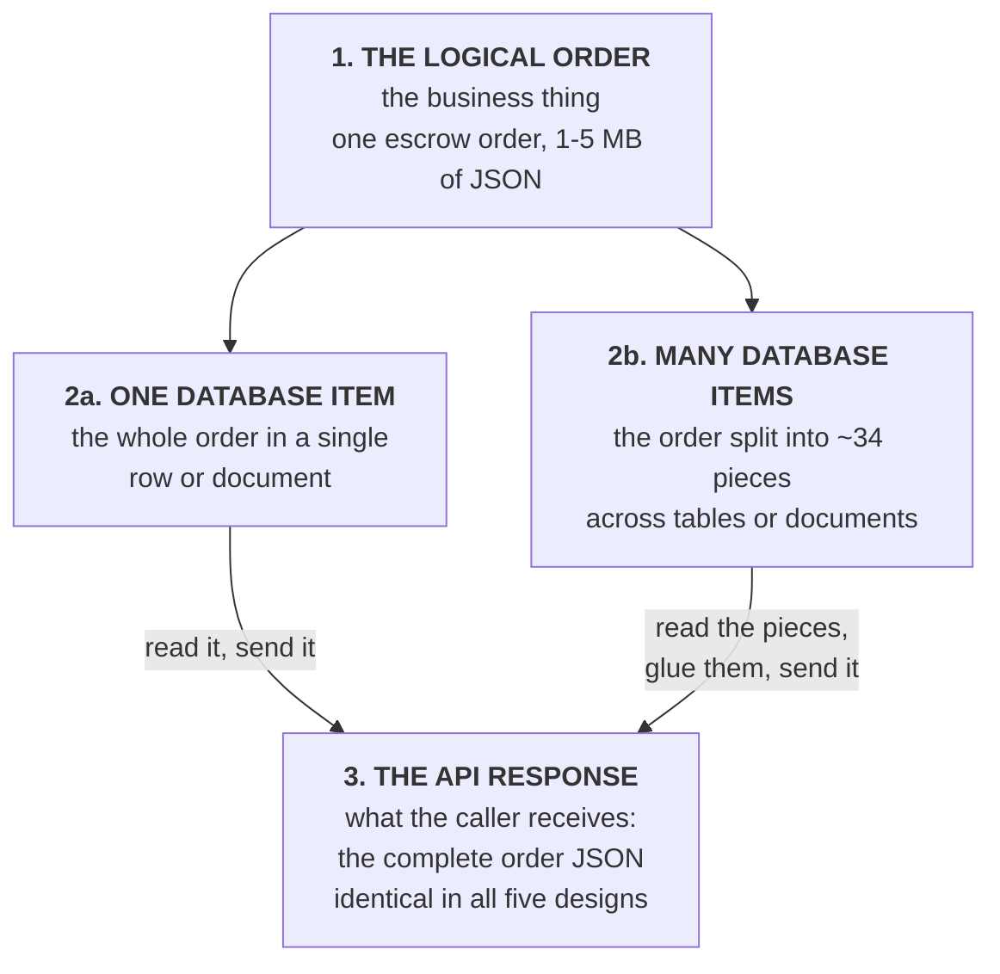
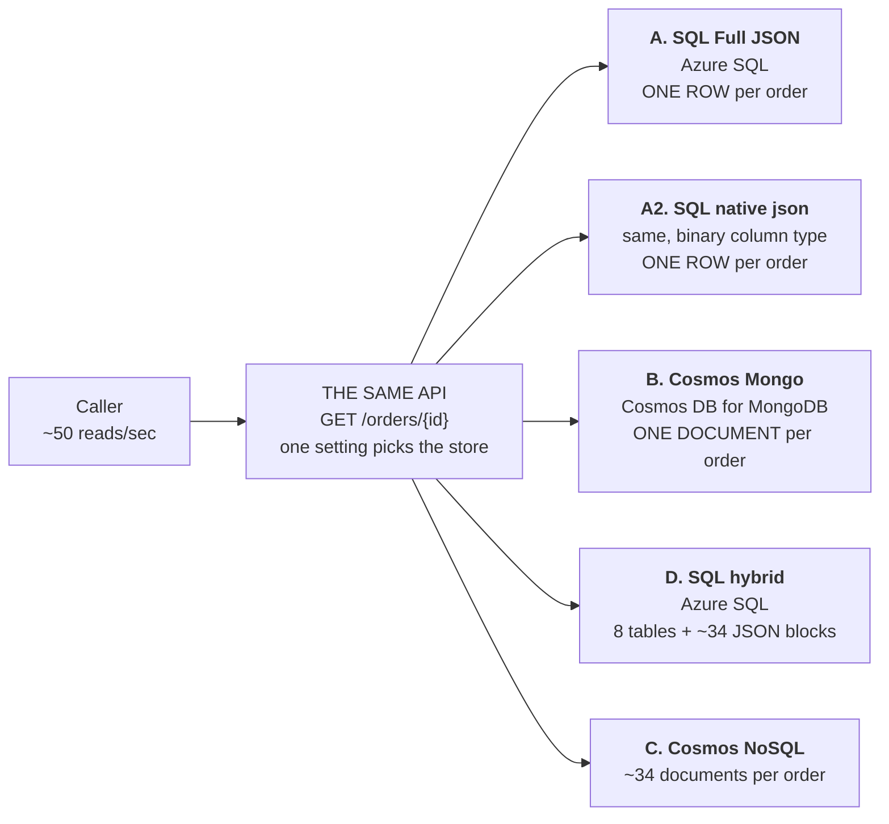
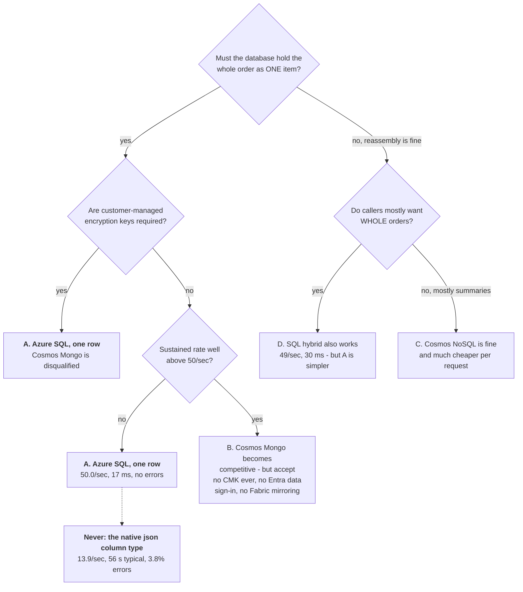
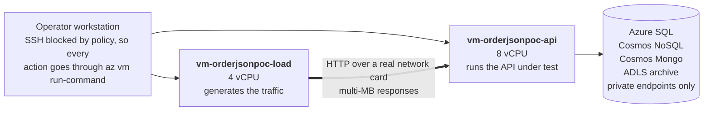

# The whole thing, in plain language

*A non-specialist walkthrough of the entire POC, updated 2026-09-15 to include
the full-document scenarios and the 50 RPS results.*

Every other document here is written for the engineer who has to build the thing.
This one is written for the person who has to **decide**. Nothing in it is new
evidence — every figure is taken from the generated result documents, and each
section says which one — but the vocabulary, the diagrams and the order of
explanation are chosen for a reader who has not been living inside the project.

**If you read nothing else, read [section 2](#2-the-answer-in-six-sentences) and
[section 8](#8-the-recommendation).**

| If you want… | Go to |
| --- | --- |
| the answer | [§2](#2-the-answer-in-six-sentences) |
| why the question kept getting misunderstood | [§3](#3-three-words-that-were-doing-three-jobs) |
| what the five designs actually are | [§4](#4-the-five-designs) |
| the measured results, explained | [§5](#5-what-we-found) |
| the security problems that no benchmark can fix | [§6](#6-the-two-problems-no-benchmark-can-fix) |
| money | [§7](#7-cost-in-plain-words) |
| the recommendation | [§8](#8-the-recommendation) |
| what those two virtual machines were for | [§9](#9-how-this-was-measured--and-what-the-two-vms-were-for) |
| what we did *not* prove | [§10](#10-what-we-did-not-measure) |
| a word you do not recognise | [§11](#11-glossary) |

---

## 1. What was asked

The customer has order documents from a title and escrow system. Each one is a
single JSON file — a text format that allows nested structure — and they are
**large**: typically between half a megabyte and five megabytes, with 106
top-level sections, deeply nested, describing the parties, the properties, the
loans, the title work, the closing disclosure, notes and checklists for one
order.

They want to know, in their words:

> "The ask is to architect the ideal solution for serving the full JSON within an
> operational workflow, such as an API. If Microsoft does not have a suitable
> solution within its stack, that is acceptable — we need to know that."

Concretely: **can a Microsoft database hold one of these complete orders and hand
it back through an API about 50 times a second, keep two years of them, and still
feed Microsoft Fabric for reporting?**

The work was done in two parts because the question sharpened halfway through.
Part 1 asked whether the *API* could return a whole order. Part 2 asked whether
the *database* could store a whole order as a single physical thing. Those sound
like the same question. They are not, and the difference is the whole of
[section 3](#3-three-words-that-were-doing-three-jobs).

---

## 2. The answer in six sentences

1. **Yes.** Microsoft has not one but two products that will store a complete
   1–5 MB order as a single database record, measured: Azure SQL accepted one row
   up to **16.70 MB**, and Cosmos DB for MongoDB accepted one document up to
   **15.04 MB**.
2. The best of the five designs tested is **Azure SQL storing the complete order
   in one row** — at the customer's stated 50 requests per second it served
   **50.0 per second with a typical response time of 17 milliseconds and zero
   errors**.
3. It was also the fastest to write, it works with Microsoft Fabric, it uses the
   same corporate sign-in as everything else, and it can be deployed as code.
4. The Cosmos DB for MongoDB option genuinely works and is **faster than Azure
   SQL once you push past 50 requests per second**, but it carries two security
   limitations that cannot be engineered away, and one of them is permanent.
5. There is one trap that looks like the obvious right answer and is not: Azure
   SQL's newer **native `json` column type collapses under this workload** —
   14 requests per second and a typical response time of **55 seconds**.
6. And the thing everyone assumed was expensive — splitting the order up and
   gluing it back together on the way out — turns out to cost **3 to 15
   milliseconds**, which is not where the money goes.

---

## 3. Three words that were doing three jobs

This is the single most important idea in the document, and it is not technical.

For weeks the phrase "store the order as JSON" was used to mean three different
things. Once they are separated, most of the apparent disagreement disappears.

- **The logical order** is the business object. One order. It never changes shape.
- **The database item** is the physical thing on disk. A design can keep one
  order as one item, or chop it into 34 items. This is a *storage* choice.
- **The API response** is what the calling application receives. In **all five**
  designs tested, this is the complete order JSON, and a test asserts they are
  equivalent.

So "can we serve the full JSON?" was answered **yes** by every design before
Part 2 even started. The real question was about the middle layer: **must the
database itself keep the order in one piece, and what does that buy?** That is
what the second half of this POC measured.

*Full version: [diagrams/terms.mmd](../diagrams/terms.mmd).*

---

## 4. The five designs

All five sit behind **exactly the same API**, in the same programme, with the same
routes. One setting chooses which storage it talks to. That is what makes the
comparison fair: we are comparing storage engines, not five different
applications.

| | What it is, in plain words | Order in one piece? |
| --- | --- | :---: |
| **A. SQL Full JSON** | A normal SQL table with one row per order. The whole order text sits in one big column, plus about a dozen small columns copied out of it so that searching never has to open the big column. | **yes** |
| **A'. SQL native `json`** | Identical, except the big column uses SQL Server's newer purpose-built JSON type, which stores a parsed binary form instead of text. | **yes** |
| **B. Cosmos Mongo** | Cosmos DB running the MongoDB interface, with a special setting turned on that raises the document size limit from 2 MB to 16 MB. One order = one document. | **yes** |
| **C. Cosmos NoSQL** | The design from Part 1. Cosmos DB's native interface caps a document at 2 MB, so the order is deliberately split into roughly 34 documents along business lines and reassembled on the way out. | no |
| **D. SQL hybrid** | The other Part 1 design. The searchable facts go into 8 proper relational tables; the bulky nested sections stay as JSON blocks. Reassembled on the way out. | no |

Two of these are new in Part 2 (A and B). C and D already existed and were not
touched — deliberately, so the earlier results stay valid.

*Technical versions: [diagrams/api-backends.mmd](../diagrams/api-backends.mmd),
[diagrams/sql-full-json.mmd](../diagrams/sql-full-json.mmd),
[diagrams/cosmos-mongo.mmd](../diagrams/cosmos-mongo.mmd),
[diagrams/full-document-comparison.mmd](../diagrams/full-document-comparison.mmd).*

---

## 5. What we found

### 5.1 How big a single record can each product actually hold?

We did not look this up. We generated progressively larger orders and pushed them
in until each product refused.

| Where the order is stored | Biggest one accepted | First size refused | How it refused |
| --- | ---: | ---: | --- |
| Azure SQL, one row, text column | **16.70 MB** | never refused | — |
| Azure SQL, one row, native `json` | **16.70 MB** | never refused | — |
| Cosmos DB for MongoDB, one document | **15.04 MB** | 16.70 MB | `DocumentTooLarge` |
| Cosmos DB for NoSQL, one document | 1.78 MB | **2.01 MB** | HTTP 413 |

The customer's orders are 0.5–5 MB. **Both Azure SQL and Cosmos Mongo clear that
range with room to spare.** The bottom row is why Part 1's Cosmos design splits
the order at all: that 2 MB wall is real, and it is a limit on the *document
shape*, not on the database.

One detail that would be easy to get wrong in production: **MongoDB does not
store your JSON text, it stores a re-encoded binary form called BSON, and for
this data that form is 1.3%–1.55% *larger*.** An order that measures 15.9 MB as a
file is over the 16 MB line once encoded. Sizing a design from file size errs in
the dangerous direction.

*Source: [DOCUMENT_SIZE_RESULTS.md](DOCUMENT_SIZE_RESULTS.md) — every figure
generated, none typed by hand.*

### 5.2 At the customer's stated 50 requests per second

Each request asks for **one complete order**, and the load is generated from a
separate machine so that the multi-megabyte responses genuinely cross a network.

| Design | Requests/sec achieved | Typical (p50) | Slow tail (p95) | Failures |
| --- | ---: | ---: | ---: | ---: |
| **A. SQL Full JSON** | **50.0** | **17 ms** | 63 ms | **none** |
| D. SQL hybrid (reassembled) | 49.0 | 30 ms | 92 ms | none |
| B. Cosmos Mongo (one document) | 49.9 | 67 ms | 181 ms | none |
| A'. SQL native `json` | 13.9 | **56 seconds** | 112 s | 3.8% |
| C. Cosmos NoSQL (reassembled) | 12.4 | **65 seconds** | 126 s | none |

Read the top three rows as: **three of the five designs do the job comfortably**,
with no errors, and the differences between them are tens of milliseconds.

The bottom two rows need care, because they fail for completely different reasons.

**A' (native `json`) genuinely cannot do this.** It is already struggling at
half-megabyte orders, and gets worse with size. The reason is specific: this
column type exists so you can reach *inside* a document cheaply. Our workload
never reaches inside — it writes the whole order and reads the whole order back —
so it pays the full cost of converting text to binary on the way in and binary to
text on the way out, and collects none of the benefit.

**C (Cosmos NoSQL) is being throttled, not failing.** Its container was
provisioned at 6,000 request units per second while the Mongo collection had
10,000 — **not a like-for-like comparison, and it must not be reported as one.**
A whole-order read on design C costs about 515 request units, so 6,000 per second
buys about 11.6 requests per second. The observed 12.4 is that arithmetic, not a
defect. In Part 1, the same design held 50 per second when given 40,000.

What survives that caveat is a ratio, which does not depend on provisioning:
fetching one order costs design C about **515** request units because it has to
collect ~34 documents, against roughly **16** for a single-document read of the
same order. **Serving whole orders from a split-up design costs on the order of
30 times more per request.** That is the real price of the 2 MB limit, and it is
the most important cost finding in Part 2.

*Source: [FULL_DOCUMENT_BENCHMARK.md](FULL_DOCUMENT_BENCHMARK.md), 46 runs.*

### 5.3 The ranking flips above 50 requests per second

This matters for planning, so it should not be buried.

| At 100 requests/sec | Achieved | Typical |
| --- | ---: | ---: |
| **B. Cosmos Mongo** | **99.8** | **73 ms** |
| A. SQL Full JSON | 95.7 | **1,532 ms** |

Azure SQL is comfortable at 50 and struggling at 100. Cosmos Mongo barely
notices. So "50 RPS is fine" is true, but it is not far from the edge — and if
the real-world rate turns out to be double the stated one, the recommendation in
[section 8](#8-the-recommendation) would need revisiting on performance grounds.

### 5.4 The bottleneck is in the client, not the network

When we pushed 5 MB orders, both Azure SQL designs flattened out at about
**150 MB per second**, with the achieved rate dropping to ~31 per second. The
tempting conclusion is "we saturated the network".

That conclusion is wrong, and we can prove it rather than argue it: **Cosmos
Mongo sustained 240.8 MB per second across the same two machines, through the
same API programme, at 49.6 requests per second.** If the wire could carry 240,
the wire was not what stopped Azure SQL at 150. The limit is in how the database
driver fetches very large values on the client side.

This is the sort of mistake that ends up in a customer report as a false network
requirement, and the only reason we caught it is that five designs were run over
identical infrastructure.

### 5.5 Reassembly is cheap. Splitting still is not.

The whole motivation for the full-document scenarios was to avoid the cost of
gluing an order back together on every read. Measured, that gluing costs:

| Order size | SQL hybrid reassembly time |
| --- | ---: |
| 0.5 MB | 3.6 ms |
| 2.0 MB | 12.8 ms |
| 4.8 MB | 15.1 ms |

Against 8–37 ms spent in the database itself, **reassembly is close to a rounding
error.** The cost of splitting an order is not the CPU to rejoin it — it is the
round trips and the request units needed to fetch 34 pieces (§5.2). That is a
useful correction to the intuition that started Part 2.

### 5.6 On Cosmos Mongo, changing one field costs as much as rewriting everything

This is the finding most likely to bite in production, and it is a property of
the storage model rather than of tuning.

| On a 4.87 MB order | Cost in request units |
| --- | ---: |
| Read the whole order | **57** |
| Change a single field | **4,768** |
| Replace the entire document | 3,458 |

Two things follow. **Reading is roughly a hundred times cheaper than writing**
(about 12 RU per MB to read, about 1,000 RU per MB to write). And **updating one
field costs more than replacing the whole document**, because the update forces
the engine to read, modify and write the document server-side while a replace
simply writes.

**There is no such thing as a cheap small edit to a large document here.** If the
customer's workflow updates orders in place — a status change, one corrected
figure — this is a serious objection to design B, independent of read speed.

### 5.7 The Fabric constraint turned out to be free

Earlier in the project we recorded that a table containing a native `json` column
**cannot be mirrored into Microsoft Fabric**, and treated the older text column
as a compromise accepted in order to keep the analytics path.

Measured, it is not a compromise at all. The text column is **up to 6x faster to
read and 10x faster to write** than the native type, and the gap widens with size.
The constraint forced us toward the option that was better anyway. That is worth
stating plainly because the earlier framing was wrong, and anyone reading the old
version would carry that error forward.

---

## 6. The two problems no benchmark can fix

Design B (Cosmos DB for MongoDB) needs a setting called
`EnableMongo16MBDocumentSupport` to hold documents above 2 MB. Both of these come
from Microsoft's own documentation, were established **before** any code was
written, and neither is affected by how fast anything runs.

**1. Turning on 16 MB documents means you can never use customer-managed
encryption keys — and you cannot turn it back off.** The capability is documented
as incompatible with customer-managed keys and as non-removable once enabled. For
a payload containing social security numbers, wire instructions and loan detail,
that is very likely a stopper in its own right. If customer-managed keys are on
the customer's control list, **design B is disqualified before performance is
discussed.**

**2. This database interface has no modern corporate sign-in for data access.**
Every other component here authenticates with Entra ID (what used to be called
Azure AD) using a managed identity, so no password exists anywhere. The MongoDB
interface on Cosmos DB supports **account keys only**. The documented workaround —
fetch the key at startup using a managed identity, which is what this POC
implements — requires granting the application a permission that can *list account
keys*. That is a **broader** permission than reading data, and it cannot be scoped
to one collection or made read-only.

There is also a third, milder issue: **design B is the only one with no native
Fabric mirroring**, so it cannot use the same analytics path as the others.

And one practical note for whoever builds it: **the 16 MB setting cannot be
applied through ARM or Bicep templates** (command line or portal only), so that
account cannot be fully declared as infrastructure-as-code — and the setting only
affects collections created *after* it is enabled, so getting the provisioning
order wrong leaves you with a silent 2 MB ceiling.

*Sources: [SOURCES.md](SOURCES.md) sections M.2, M.5, M.6 — each with the
Microsoft documentation quoted and linked.*

---

## 7. Cost in plain words

Two different shapes of bill, which is more important than the totals.

**Azure SQL bills for a machine size.** Roughly **$222/month** for the 2-vCore
tier this workload needed. That number does not move when the API's traffic shape
changes.

**Cosmos DB bills per request,** so the bill follows what the API actually does:

| If the API mostly serves… | Cosmos DB, per month |
| --- | ---: |
| summaries and search only | **$23** |
| a realistic mixture | **$426** |
| complete orders, every time | **$2,254** |

That is a **97x spread on the same data**, driven purely by API design. The same
spread is why §5.2's request-unit ratio matters more than any latency figure: on
a whole-order API, the split-up Cosmos design is the expensive one, and against
Azure SQL's flat $222 it is roughly **10x**.

Storage and the archive are broadly the same either way: about $50/month for
Azure SQL storage or $110 for Cosmos at 441 GB, plus about $19–33/month for two
years of compressed original files in cheap storage. Microsoft Fabric at its
smallest continuous size is about $263/month regardless of choice.

*Every rate is pulled live from Microsoft's public pricing API, not typed in:
[COST_ANALYSIS.md](COST_ANALYSIS.md).*

---

## 8. The recommendation

**Store each complete order as one row in Azure SQL, in a text JSON column, with
about a dozen searchable fields copied out alongside it.** Design A.

It wins on every axis we measured, and it wins without a trade to justify:

- it stores the complete order at every size tested, up to 16.70 MB;
- it reads and writes it faster than anything else tested at the stated workload;
- it hits 50 requests per second with a 17 ms typical response and no errors;
- it mirrors into Microsoft Fabric;
- it signs in with Entra ID like every other component, so no keys are involved;
- it can be deployed as code.

**What this recommendation is not saying:**

- It is **not** saying Cosmos DB is a bad product. On a summary-and-search API,
  Cosmos is a tenth of the cost, and above 50 requests per second Cosmos Mongo is
  measurably faster than Azure SQL at this. The right answer depends on the API
  shape, and the API shape is the customer's decision.
- It is **not** saying the existing split-up design was a mistake. It meets the
  stated workload, and reassembly costs almost nothing (§5.5).
- It is **not** an endorsement of Cosmos DB for MongoDB (RU) as a destination.
  Microsoft's own documentation now points new work elsewhere — to Azure
  DocumentDB for MongoDB compatibility, or to Cosmos DB for NoSQL for high
  scale — and Azure DocumentDB would resolve two of the three governance problems
  in §6. We did not build or benchmark it, so that is a documented option, not a
  measured one.
- It is **not** final if the real rate is much higher than 50 per second, or if
  orders routinely update in place. Both of those change the arithmetic, and §5.3
  and §5.6 say how.

---

## 9. How this was measured — and what the two VMs were for

Two virtual machines appear throughout this repository. They are **test equipment,
not part of the proposed architecture.** Nothing the customer would deploy depends
on them, and they are deleted by the teardown script. Their existence is worth
explaining because the numbers are only trustworthy if the measuring setup was.

**`vm-orderjsonpoc-api` runs the API being tested.** One storage backend is
active at a time; a health check is asserted before every run so results can never
be attributed to the wrong database. (That guard caught a real mistake: an
ad-hoc verification once measured whichever backend happened to be loaded while
labelling the results with a different one.)

**`vm-orderjsonpoc-load` generates the load,** and it is a separate machine for
three specific reasons:

1. **The traffic is genuinely heavy.** 50 requests per second at a ~1.3 MB mean
   response is about 65 MB/s sustained, with the largest orders near 5 MB. That
   cannot be measured over an office or home internet connection — the connection
   would *be* the result.
2. **There was no public path to test.** Tenant policy forced private-only
   endpoints on every data store, so the test had to run inside the virtual
   network. That constraint made the numbers better founded, not worse.
3. **Sharing one machine would have hidden the network and distorted the CPU.**
   Generator and API on the same box means responses travel over loopback at
   memory speed, and the generator competes for CPU with the thing it is
   measuring. Two machines means the payload crosses a real network card and the
   two CPU budgets are independent.

That third point is not hypothetical: the split is exactly what let us prove the
150 MB/s ceiling was *not* the network (§5.4). A single-machine test could not
have distinguished those.

Two further deliberate choices in the harness:

- **The load generator sends on a fixed schedule, not from a pool of looping
  workers.** A looping generator quietly sends *less* traffic when the server
  slows down, so latency looks flat while the system is actually failing — a
  well-known measurement error called coordinated omission. Here, requests go out
  on schedule regardless, and latency is timed from when a request was *due*, so
  queueing shows up in the number. That is why the failing rows in §5.2 show
  56-second responses instead of a reassuring plateau.
- **Every number in the result documents is generated by a script from
  machine-readable run files.** The headers of those documents say so: *"No figure
  in this document was typed by hand."*

*Full method and its limitations: [BENCHMARK_METHOD.md](BENCHMARK_METHOD.md).
Topology diagram: [diagrams/benchmark-topology.mmd](../diagrams/benchmark-topology.mmd).*

---

## 10. What we did not measure

Stated plainly, because a POC that only lists its successes is not evidence.

| Not established | Why it matters |
| --- | --- |
| **Cosmos NoSQL and Cosmos Mongo were not equally provisioned** in the 50 RPS sweep (6,000 vs 10,000 RU/s). | Design C's 12.4 requests/sec is throttling, not incapability. Any comparison of those two rows must say so. |
| **Azure DocumentDB was not built or benchmarked.** | It is Microsoft's recommended destination for MongoDB-compatible work and would resolve two of the three governance problems in §6. Everything said about it here is documentation, not measurement. |
| **The indexing experiment for large Mongo documents has not been run.** | Microsoft's documentation warns against wildcard indexes on large documents without giving a number. The experiment is written ([tools/mongo_index_experiment.py](../tools/mongo_index_experiment.py)) but needs the environment. |
| **The five-way equivalence tests have not been run against live resources.** | The structural derivation is shared and unit-tested, and the sweep asserted the active backend before every run, but the live contract assertion is still pending. |
| **Analytics freshness is not reproducible right now.** | The custom mirroring extractor used for the analytics measurement stalled, and rebuilding it is waiting on a decision (whether to create a second mirrored item alongside the existing one, or delete and recreate it). |
| **Single region, single replica, no failover test.** | No multi-region read routing and no resilience testing was in scope. |
| **Two years of data was modelled, not accumulated.** | Retention figures are derived from measured per-order sizes, not from a database that has actually been running for two years. |

---

## 11. Glossary

| Term | Plain meaning |
| --- | --- |
| **JSON** | A text format that stores nested, labelled data. The customer's orders arrive as one JSON file each. |
| **BSON** | MongoDB's binary re-encoding of JSON. For this data it is 1.3–1.55% *larger* than the JSON text. |
| **Document / item / row** | One physical record in a database. The whole argument of Part 2 is whether one order should be one of these. |
| **API** | The service an application calls to get an order back. Here: `GET /orders/{id}`. |
| **RPS** | Requests per second. The customer's stated operational load is ~50 reads/sec of complete orders. |
| **p50 / p95** | The typical response time and the slow-tail response time. p95 = 95% of requests were faster than this. Both matter; p95 is what users complain about. |
| **RU (request unit)** | Cosmos DB's unit of billing and rationing. You buy a number of RU per second; every read and write spends some. Run out and requests are throttled. |
| **Throttling** | The database refusing or delaying work because the purchased rate has been used up. Not a failure — a budget limit. |
| **Reassembly / reconstruction** | Rebuilding one complete order from the pieces a split-up design stored. Measured at 3–15 ms (§5.5). |
| **Mirroring** | Microsoft Fabric's mechanism for continuously copying an operational database into its analytics storage. |
| **Entra ID** | Microsoft's corporate identity system (formerly Azure AD). Using it means no passwords or keys in the application. |
| **Managed identity** | An identity Azure gives to the application itself, so it can sign in without any stored credential. |
| **Customer-managed keys (CMK)** | Encryption where the customer controls the key. Frequently a mandatory control for regulated data — and incompatible with the 16 MB Mongo setting (§6). |
| **Coordinated omission** | A common load-testing error that makes an overloaded system look healthy. Avoided here deliberately (§9). |

---

## 12. Where each number in this document comes from

| Section | Generated source |
| --- | --- |
| §5.1 size limits, BSON encoding | [DOCUMENT_SIZE_RESULTS.md](DOCUMENT_SIZE_RESULTS.md) |
| §5.2–5.5 the 50 RPS sweep | [FULL_DOCUMENT_BENCHMARK.md](FULL_DOCUMENT_BENCHMARK.md) |
| §5.6 Mongo write costs | [DECISION_MATRIX.md](DECISION_MATRIX.md) §13.2 |
| §5.7 native `json` comparison | [DECISION_MATRIX.md](DECISION_MATRIX.md) §13.1 |
| §6 security constraints | [SOURCES.md](SOURCES.md) M.2, M.5, M.6 |
| §7 cost | [COST_ANALYSIS.md](COST_ANALYSIS.md) |
| §8 recommendation | [DECISION_MATRIX.md](DECISION_MATRIX.md) §15, [CUSTOMER_QUESTIONS.md](CUSTOMER_QUESTIONS.md) |
| §9 method | [BENCHMARK_METHOD.md](BENCHMARK_METHOD.md) |
| Part 1 results | [../results/BENCHMARK_SUMMARY.md](../results/BENCHMARK_SUMMARY.md) |

For a slide deck or a drawn diagram built from this material, use
[PRESENTATION_PROMPT.md](PRESENTATION_PROMPT.md) — it carries the same figures
with instructions not to invent any.
